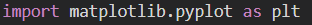
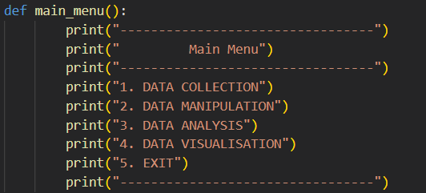

Data\_Visualization\_Using\_Python

-----
The aim of this project is to collect, manipulate, visualize and analyze data taken from Kaggle.

Libraries used: -

-----
- **Numpy**

**Importing Numpy Library**

**About Numpy**

Numpy is a library for the Python programming language, adding support for large, multi-dimensional arrays and matrices, along with a large collection of high-level mathematical functions to operate on these arrays.

- **Pandas**

**Importing Pandas Library**

**About Pandas**

Pandas is a Python package providing fast, flexible, and expressive data structures designed to make working with “relational” or “labeled” data both easy and intuitive. It aims to be the fundamental high-level building block for doing practical, real-world data analysis in Python.

- **Matplolib.pyplot**

**Importing Matplotlib.pyplot**

**About Matplotlib.pyplot**

Matplotlib.pyplot is a collection of functions that make matplotlib work like MATLAB. Each pyplot function makes some change to a figure: e.g., creates a figure, creates a plotting area in a figure, plots some lines in a plotting area, decorates the plot with labels, etc.

- **Sys Module**

**Importing Sys**

**About Sys**

The python sys module provides functions and variables which are used to manipulate different parts of the Python Runtime Environment. It lets us access system-specific parameters and functions.

Various Menus Made: -

-----

- For Data Collection

- For Data Manipulation

- For Updating Data

- For Sorting Data

- For Adding another dataframe

- For Data Analysis

Data Analysis

-----
- Based on City v/s Total Literates

